<div align="center">

# RMB

### Reward Model Boosting Mitigates Reward Hacking

[](https://www.python.org/)
[](https://pytorch.org/)
[](https://xgboost.readthedocs.io/)
[](LICENSE)

**Complementary reward signals in Stage 1. Residual-error correction in Stage 2.**



</div>

RMB builds a robust scalar reward from an ensemble of deliberately diverse
reward models. Instead of averaging their outputs, it learns how to combine
their strengths with a pairwise boosted ranker.

The repository includes the complete two-stage training path, evaluation
utilities, Best-of-N experiments, and PPO workflows.

## Contents

- [Why RMB](#why-rmb)
- [Method](#method)
- [Implementation highlights](#implementation-highlights)
- [Quick start](#quick-start)
- [Training](#training)
- [Outputs](#outputs)
- [Repository map](#repository-map)

## Why RMB

A single reward model can achieve strong held-out accuracy while retaining
systematic blind spots. During policy optimization, those blind spots can be
amplified into reward hacking.

RMB addresses this with two ideas:

1. **Learn complementary preference functions.** Several reward branches are
   optimized jointly with a Bradley-Terry objective and a dependence penalty.
2. **Learn the aggregation rule.** A boosted ranker combines their response
   scores and focuses successive trees on ranking errors left by earlier trees.

The result is not merely an average ensemble. It is an additive correction
model trained directly on pairwise preferences.

## Method

For a preference tuple `(x, y_w, y_l)`, component `i` produces

```text
m_i = r_i(x, y_w) - r_i(x, y_l)
```

### Stage 1: diverse reward models

The first stage minimizes

```text
L_stage1 = mean_i[-log sigmoid(m_i)]
           + lambda_HSIC * mean_{i<j}[normalized_HSIC(m_i, m_j)]
```

HSIC is evaluated on **preference margins**, not raw reward levels. Minimizing
the positive normalized-HSIC term reduces statistical dependence between
components while preserving their individual preference accuracy.

For small micro-batches, the implementation estimates the kernel statistic with
a rolling buffer of detached historical margins. Gradients still flow only
through the current batch.

### Stage 2: reward model boosting

Each response becomes a reward feature vector:

```text
R(x, y) = [r_1(x, y), ..., r_N(x, y)]
```

The final score is an additive tree ensemble:

```text
F_K(R) = sum_{k=1..K} f_k(R)
```

XGBoost uses `rank:pairwise`, with every group arranged as
`[chosen, rejected]`. Validation pair accuracy controls early stopping and
selects the saved booster.

## Implementation highlights

| Area | Behavior |
|---|---|
| Dependence target | Normalized HSIC over preference margins |
| Kernel estimator | Median bandwidth and all component pairs |
| Joint optimization | Every reward branch remains trainable throughout the combined loss |
| Gradient checkpointing | Backward recomputation is bound to the branch used by the original forward |
| Validation | Stage-1 checkpoints are selected on held-out preferences |
| Stacking split | Stage 2 uses rows disjoint from Stage 1 |
| Distributed extraction | Complete chosen/rejected pairs are gathered before row flattening |
| Padding | Rewards are read from the last attended token for left or right padding |
| Checkpoints | Nested and legacy-flat component layouts are accepted |
| Boosting | Pair-accuracy early stopping saves the true best iteration |

The current implementation shares a frozen language-model backbone across
lightweight PEFT reward branches and gives each branch an independent value
head. This is an efficiency choice; the RMB objective itself is defined by
component diversity and boosted aggregation.

### Data contract

A pairwise training dataset must expose:

```text
input_ids_chosen        attention_mask_chosen
input_ids_rejected      attention_mask_rejected
```

The reproducible Unified-Feedback path uses disjoint post-filter strides:

| Mode | Purpose | Indices |
|---|---|---|
| `40K` | Stage-1 reward training | `0, 20, 40, ...` |
| `40K-heldout` | Stage-2 booster fitting | `1, 21, 41, ...` |
| validation split | Model selection and early stopping | Dataset-provided validation |

Training the booster on Stage-1 rows creates stacking leakage and can
substantially inflate its apparent performance.

## Quick start

### Local environment

```bash
python -m venv .venv
source .venv/bin/activate
python -m pip install --upgrade pip
python -m pip install -r requirements-hpc.txt
```

### Generic Slurm templates

The three main entry points below are portable Slurm templates. They contain no
account, partition, institution, or user-specific paths. Cluster-specific
modules can be supplied at submission time:

```bash
RMB_MODULES="your-python-module your-arrow-module" \
  sbatch --export=ALL scripts/setup_env.slurm
```

When `$SCRATCH` exists, artifacts default to `$SCRATCH/rmb`. Otherwise they
are stored under `.artifacts/rmb`. Override this with `RMB_WORK_ROOT`.

### Stage 1

```bash
sbatch scripts/train_hsic_rms.sh
```

Common overrides:

```bash
NUM_TRAIN_EPOCHS=3 NUM_ADAPTERS=3 HSIC_LAMBDA=0.1 \
  sbatch --export=ALL scripts/train_hsic_rms.sh
```

### Stage 2

Point the booster at the outer `best_step_*` checkpoint produced by Stage 1:

```bash
export ADAPTER_CHECKPOINT="/path/to/best_step_<STEP>_acc=<ACC>"
sbatch --export=ALL scripts/rmb_boosting.sh
```

The booster is written to `<work-root>/results/rmb_booster.json`.

## Training

### Stage-1 controls

| Variable | Default | Meaning |
|---|---:|---|
| `BASE_MODEL` | `google/gemma-2b-it` | Shared frozen backbone |
| `DATASET_MODE` | `40K` | Stage-1 subset |
| `NUM_ADAPTERS` | `3` | Number of reward components |
| `HSIC_LAMBDA` | `0.1` | Dependence penalty |
| `LEARNING_RATE` | `1e-5` | AdamW learning rate |
| `MICRO_BATCH_SIZE` | `2` | Per-device micro-batch |
| `GRADIENT_ACCUMULATION_STEPS` | `8` | Effective-batch multiplier |
| `SEED` | `32` | Dataset and optimization seed |

Before the first optimizer update, a fail-fast check verifies that every reward
component received finite, non-zero gradients.

### Stage-2 controls

| Variable | Default | Meaning |
|---|---:|---|
| `ADAPTER_CHECKPOINT` | required | Stage-1 `best_step_*` directory |
| `DATASET_MODE` | `40K-heldout` | Leakage-free booster rows |
| `NUM_ROUND` | `256` | Maximum number of trees |
| `EARLY_STOPPING` | `30` | Pair-accuracy patience |
| `XGB_MAX_DEPTH` | `5` | Tree depth |
| `XGB_REG_LAMBDA` | `0.1` | Leaf L2 regularization |
| `BATCH_SIZE` | `8` | Reward-feature extraction batch |

For a short pipeline check, use `--max_train_samples` and
`--max_eval_samples` with `reward_models/run_booster_rmb.py`.

## Outputs

A Stage-1 checkpoint stores only trainable reward components, their value
heads, and the tokenizer. The unchanged backbone is not duplicated:

```text
best_step_<STEP>_acc=<ACC>/
|-- adapter_0/
|   |-- adapter_0/adapter_config.json
|   |-- adapter_0/adapter_model.safetensors
|   `-- v_head.bin
|-- adapter_1/
|-- adapter_2/
|-- tokenizer.json
`-- tokenizer_config.json
```

The boosted model records:

- `feature_mode=response`
- `best_iteration`
- `best_pair_accuracy`

These attributes allow downstream inference to validate the expected feature
pipeline.

## Evaluation and RLHF

Reward-model evaluation entry points live in `rm_eval/` and
`scripts/eval_*.sh`. Downstream workflows are organized under `rlhf/`:

- `rlhf/bon/`: Best-of-N generation, scoring, selection, and analysis.
- `rlhf/ppo/`: PPO with baseline, ensemble, GRM, or RMB rewards.
- `rlhf/data_generation/`: preference and gold-score preparation.

Keep checkpoint selection separate from final out-of-distribution reporting.
Unified-Feedback validation is the default selection set; HHH, MT-Bench, and
RewardBench can remain untouched until final evaluation.

## Repository map

```text
RMB/
|-- reward_models/
|   |-- hsic_rms_train.py       # Stage 1: diverse reward training
|   |-- run_booster_rmb.py      # Stage 2: pairwise boosting
|   |-- grm_utils.py            # multi-value-head wrapper
|   |-- load_datasets.py        # train and held-out builders
|   `-- reward_trainer.py       # pair collation and RM losses
|-- rm_eval/                    # reward-model evaluation
|-- rlhf/                       # Best-of-N, PPO, and data generation
|-- scripts/                    # local and Slurm entry points
|-- docs/assets/                # README visual assets
|-- requirements-hpc.txt
`-- README.md
```

## Troubleshooting

| Symptom | Check |
|---|---|
| Only the final component changes | The first-step gradient check should report finite norms for every branch |
| HSIC is always zero | Use at least two components and enough directional margins |
| Reward changes with padding side | Confirm the updated `last_non_pad_indices` path is used |
| XGBoost group-size error | Keep rows interleaved as `[chosen, rejected]` |
| Booster looks unrealistically strong | Confirm Stage 1 and Stage 2 use disjoint rows |
| Checkpoint cannot load | Point to the outer `best_step_*` directory |

## Acknowledgments

RMB builds on [Generalizable Reward Modeling](https://github.com/YangRui2015/Generalizable-Reward-Model),
[Transformers](https://github.com/huggingface/transformers),
[TRL](https://github.com/huggingface/trl),
[PEFT](https://github.com/huggingface/peft),
[XGBoost](https://github.com/dmlc/xgboost), and
[RLHFlow](https://github.com/RLHFlow/RLHF-Reward-Modeling).

Citation metadata will be added with the public paper release.
